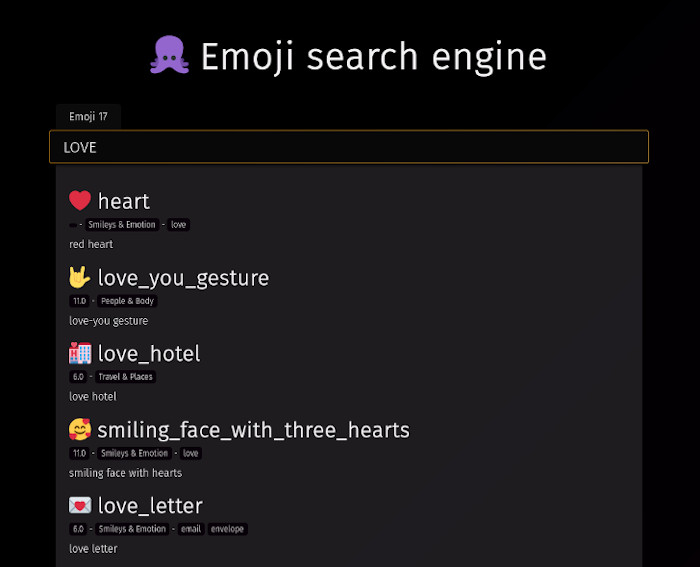

Poulpe emojis search engine
===========================

This project is a simple emoji search engine.
It is blazing fast in your terminal or your browser.

You can test it here http://poulpe.ztec.fr

[](web/statics/poster.png)
## Features

You can use the built-in web server to deploy this search engine anywhere.

```bash
>$ poulpe server
INFO[0000] Server listening on 0.0.0.0:8080 
```
then got to [localhost:8080](http://localhost:8080)

 > You can specify the binding address and port via `--bind-address` and `--port`
 

If you prefer staying in your terminal, you can use it there to. As long as your terminal support emojis

```bash
>$ poulpe search sun
☀️      sunny   "sun"   Travel & Places weather
🌞      sun_with_face   "sun with face" Travel & Places summer
🌤️     sun_behind_small_cloud  "sun behind small cloud"        Travel & Places 
🌥️     sun_behind_large_cloud  "sun behind large cloud"        Travel & Places 
🌦️     sun_behind_rain_cloud   "sun behind rain cloud" Travel & Places 
⛅       partly_sunny    "sun behind cloud"      Travel & Places weather,cloud
```

### Local database
The first run will fetch the emoji data from the great internet and then index it. It can take some times.
Once done, a local copy is kept, and it is now blazing fast.


## Docker
If you with to test or deploy this, you can use the following docker image [git2.riper.fr/ztec/poulpe:latest](https://git2.riper.fr/ztec/-/packages/container/poulpe/latest)

```
>$ docker run -p 8080:8080 -ti git2.riper.fr/ztec/poulpe:latest
```

then got to [localhost:8080](http://localhost:8080)

## Contribute

This a go project. You  are welcome to contribute. Either open a Pull Request on the GitHub version of this repository or send me
a patch or fork details via email at `poulpe @robase riper.fr` or via socials medias.

This project is available as a copy on GitHub, however the source of truth is located at [git2.riper.fr/ztec/poulpe](https://git2.riper.fr/ztec/poulpe)

### Disclaimer regarding the front/Javascript

This project was created for my personal need. I'm no frontend developer, and I wanted something basic. Frontend code is
a mess, but I don't care for me. You can improve it if you wish but don't talk to me about React or anything like this if 
you don't bring a full Contribution to include that ;-) 

Tested on a truly free browser: Firefox. Should work on all browser that support standards.


## Licence
This project is under [Creative Commons CC BY-NC 4.0](https://creativecommons.org/licenses/by-nc/4.0/deed.en)

```
Attribution-NonCommercial 4.0 International (CC BY-NC 4.0) 

This is a human-readable summary of (and not a substitute for) the license.
You are free to:

    Share — copy and redistribute the material in any medium or format
    Adapt — remix, transform, and build upon the material

    The licensor cannot revoke these freedoms as long as you follow the license terms.

Under the following terms:

    Attribution — You must give appropriate credit, provide a link to the license, and indicate if changes were made. You may do so in any reasonable manner, but not in any way that suggests the licensor endorses you or your use.

    NonCommercial — You may not use the material for commercial purposes.

    No additional restrictions — You may not apply legal terms or technological measures that legally restrict others from doing anything the license permits.

Notices:

    You do not have to comply with the license for elements of the material in the public domain or where your use is permitted by an applicable exception or limitation.
    No warranties are given. The license may not give you all of the permissions necessary for your intended use. For example, other rights such as publicity, privacy, or moral rights may limit how you use the material.
```

The embedded font [Fira Sans](https://en.wikipedia.org/wiki/Fira_(typeface)) by Erik Spiekermann and Ralph du Carrois has its own licence: [SIL Open Font License](https://en.wikipedia.org/wiki/SIL_Open_Font_License)